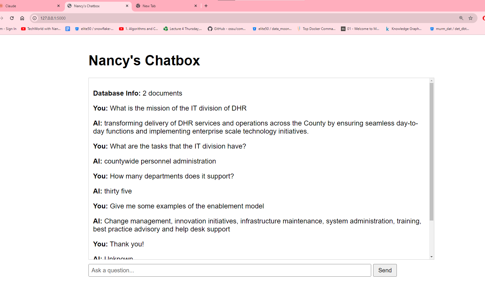

# Create a simple chatbot for the introduction of the DHR IT division.

The chatbot should be able to answer questions about the DHR IT division described under the *information technology services* section of the website: https://hr.lacounty.gov/our-organization/. 

The LLM model used is the Llama model which is free. The vector database is the ChromaDB. Langchain is used for orchestration.

To use the chatbot:

step 1: To create the vector database, run the create_database.py file first: *python create_database.py*

step 2: Then run the app.py file to start the chatbot: *python app.py* in the browser.

The address is localhost:5000. A chat window will pop up like the following screenshot.

